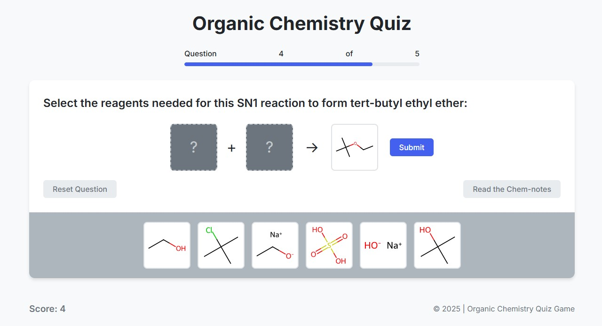

# Organic Chemistry Quiz Game

<div align="center">
  
  <h3>Interactive Learning for Chemistry Students</h3>
</div>

An interactive educational web application designed to help students learn organic chemistry reactions through drag-and-drop quizzes.



## Features

- **Interactive Drag-and-Drop Interface**: Easily move reagents to complete reaction mechanisms
- **Multiple Reaction Types**: Practice various organic chemistry reactions including:
  - SN1/SN2 Substitution Reactions
  - E1/E2 Elimination Reactions
  - Williamson Ether Synthesis
  - Esterification
  - Grignard Reactions
- **Chemistry Notes**: Access detailed explanations for each reaction type
- **Progress Tracking**: Monitor your learning with scoring and progress indicators
- **Mobile-Friendly Design**: Learn on any device with touch support
- **Audio Feedback**: Sound effects enhance the learning experience

## Demo

Try the live demo: [https://muzapro.github.io/Organic-Chemistry-Quiz-JS/](https://muzapro.github.io/Organic-Chemistry-Quiz-JS/)

## Installation

1. Clone the repository:
   ```
   git clone https://github.com/your-username/Organic-Chemistry-Quiz-JS.git
   ```

2. Navigate to the project directory:
   ```
   cd Organic-Chemistry-Quiz-JS
   ```

3. Open the project in VS Code or your preferred editor

4. Launch with a local server:
   - Using VS Code Live Server extension
   - Or with Python: `python -m http.server`
   - Or with Node.js: `npx serve`

## Project Structure

```
organic-chemistry-quiz/
│
├── index.html              # Main HTML file
├── css/
│   └── styles.css          # Main stylesheet
│
├── js/
│   ├── app.js              # Main application logic
│   ├── quiz-engine.js      # Quiz functionality
│   ├── drag-drop.js        # Drag and drop functionality
│   └── audio.js            # Audio system for sound effects
│
├── data/
│   └── questions.json      # Question database
│
├── assets/
│   ├── images/             # Icons, backgrounds, etc
│   ├── molecules/          # SVG files for molecule structures
│   └── sound/              # Sound effects
│
└── README.md               # Project documentation
```

## Adding New Questions

To add new questions to the quiz, edit the `data/questions.json` file:

1. Each question requires:
   - Unique `id`
   - Question text
   - Product information (what is being synthesized)
   - List of available reagents
   - Correct reagent combination
   - Reaction type
   - Feedback messages
   - Chemistry notes

2. Example question format:
   ```json
   {
     "id": "q6",
     "questionText": "Complete this reaction to form...",
     "product": {
       "name": "Product Name",
       "formula": "Chemical Formula",
       "imagePath": "assets/molecules/product-name.svg",
       "textRepresentation": "Text Representation"
     },
     "reagents": [
       // List of reagent objects
     ],
     "correctReagents": ["reagent-id-1", "reagent-id-2"],
     "reactionType": "Reaction Type",
     "correctFeedback": "Correct answer feedback",
     "incorrectFeedback": "Incorrect answer feedback",
     "chemistryNotes": "Detailed notes about the reaction"
   }
   ```

## Adding New Molecule SVGs

1. Create SVG files for new molecules
2. Place them in the `assets/molecules/` directory
3. Reference them in the `questions.json` file

## Mobile Support

The application supports touch interactions on mobile devices:
- Drag molecules with touch gestures
- Tap to place or remove molecules
- Responsive design adapts to different screen sizes
- Optimized for both portrait and landscape orientations

## Customization

- **Styling**: Edit `css/styles.css` to customize colors, fonts, and layout
- **Behavior**: Modify the JavaScript files to change quiz functionality
- **Questions**: Update `data/questions.json` to add or modify questions
- **Sounds**: Replace audio files in `assets/sound/` directory

## Technologies Used

- HTML5
- CSS3 
- JavaScript (ES6+)
- Drag and Drop API
- Hammer.js for touch events
- Web Audio API

## Browser Support

- Chrome (latest)
- Firefox (latest)
- Safari (latest)
- Edge (latest)
- Mobile browsers (iOS Safari, Android Chrome)

## Contributing

Contributions are welcome! Please feel free to submit a Pull Request.

1. Fork the project
2. Create your feature branch (`git checkout -b feature/amazing-feature`)
3. Commit your changes (`git commit -m 'Add some amazing feature'`)
4. Push to the branch (`git push origin feature/amazing-feature`)
5. Open a Pull Request

## License

This project is licensed under the MIT License - see the LICENSE file for details.

## Acknowledgments

- Inspired by the organic chemistry course curriculum
- Molecule representations based on IUPAC conventions
- Special thanks to all educators who provided feedback during development

---

Developed with ❤️ for chemistry students
