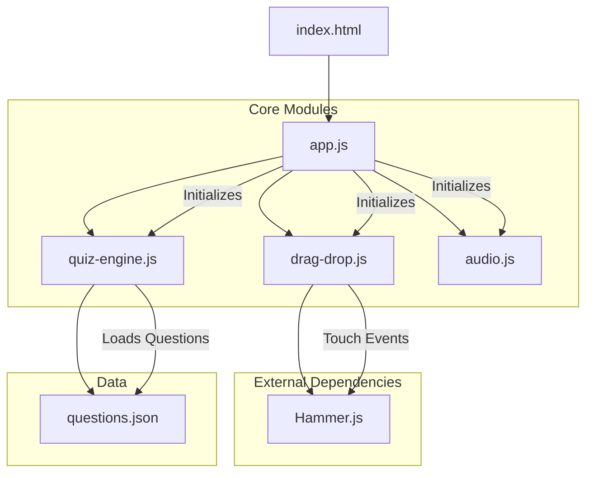
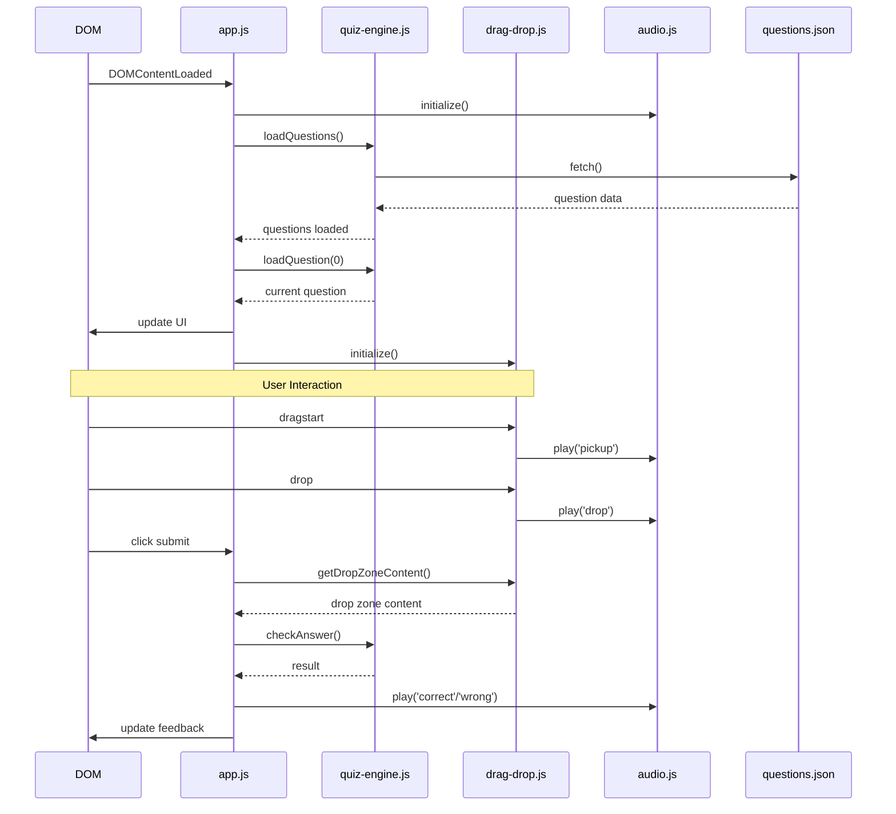
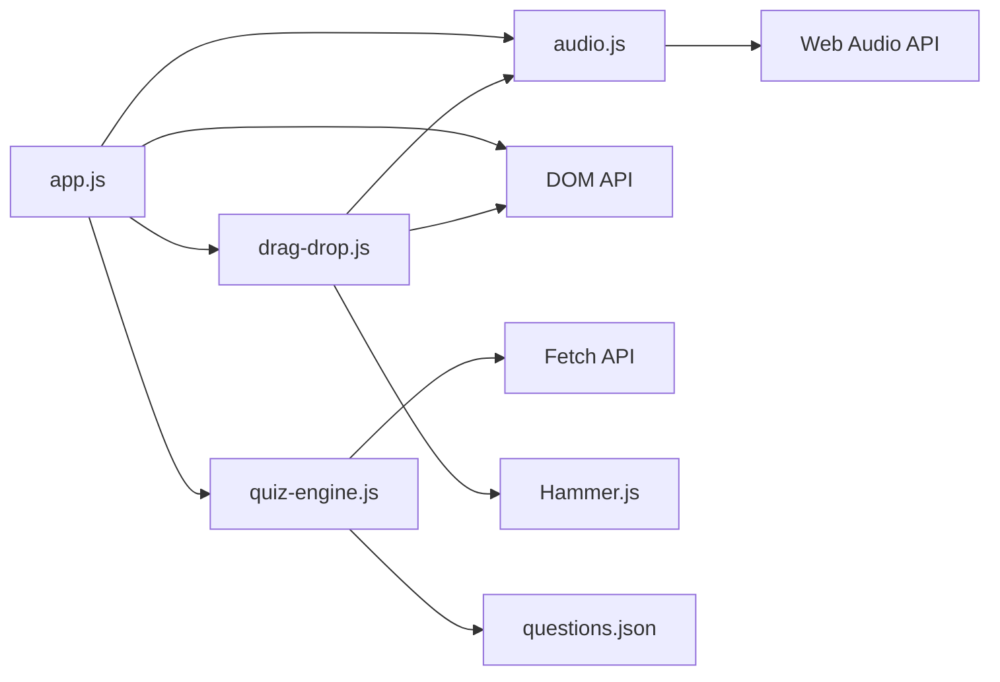

# Organic Chemistry Quiz Game: Technical Architecture

## Table of Contents
- [System Architecture Overview](#system-architecture-overview)
- [Architecture Diagram](#architecture-diagram)
- [Design Patterns](#design-patterns)
- [Component Interactions](#component-interactions)
- [Data Flow](#data-flow)
- [Module Dependencies](#module-dependencies)
- [State Management](#state-management)
- [Technical Decisions](#technical-decisions)

## System Architecture Overview

The Organic Chemistry Quiz Game uses a modular frontend architecture built with vanilla JavaScript. It follows component-based design principles without relying on a framework. The application is structured around several core modules that handle specific functionality domains, with clear separation of concerns and well-defined interfaces between components.

The architecture prioritizes:
1. **Modularity**: Independent components with specific responsibilities
2. **Maintainability**: Clean code with consistent patterns
3. **Performance**: Optimized for smooth interactions
4. **Extensibility**: Easy to add new features and questions
5. **Compatibility**: Works across modern browsers and devices

## Architecture Diagram



## Design Patterns

The application implements several key design patterns:

### 1. Module Pattern
Each core JavaScript file uses the Immediately Invoked Function Expression (IIFE) pattern to create private scopes and expose only intended public methods:

```javascript
const ModuleName = (() => {
    // Private variables and functions
    let privateVar = 'value';
    
    function privateFunction() {
        // Implementation
    }
    
    // Public API
    return {
        publicMethod1: function() { /* Implementation */ },
        publicMethod2: function() { /* Implementation */ }
    };
})();
```

This pattern enables encapsulation and prevents global namespace pollution.

### 2. Event-Driven Architecture
The application uses a DOM event-driven approach for handling user interactions and component communication:

```javascript
// Example: Event listeners for user interactions
submitButton.addEventListener('click', handleSubmit);
nextButton.addEventListener('click', handleNextQuestion);
```

### 3. Factory Pattern
Used for creating standardized objects like questions and reagents:

```javascript
// Example: Creating reagent cards
reagentBank.forEach(reagent => {
    const reagentCard = document.createElement('div');
    reagentCard.className = 'reagent-card';
    reagentCard.setAttribute('data-id', reagent.id);
    // Additional setup...
});
```

### 4. State Management
Each module maintains its own state, with clear interfaces for state changes:

```javascript
// Example: QuizEngine manages question state
const QuizEngine = (() => {
    // Private state
    let questions = [];
    let currentQuestionIndex = 0;
    let score = 0;
    
    // Public methods to interact with state
    return {
        getCurrentQuestion: () => questions[currentQuestionIndex],
        getScore: () => score
        // Additional methods...
    };
})();
```

## Component Interactions

The application consists of several core components that interact as follows:

### 1. Main Application (`app.js`)
- Acts as the controller and entry point
- Initializes all other modules
- Handles high-level user interactions
- Orchestrates communication between modules

### 2. Quiz Engine (`quiz-engine.js`)
- Loads and manages question data
- Tracks user progress and score
- Evaluates answers
- Provides question navigation

### 3. Drag and Drop Handler (`drag-drop.js`)
- Manages drag-and-drop interactions
- Handles both mouse and touch events
- Maintains state of dragged elements
- Evaluates drop targets

### 4. Audio Manager (`audio.js`)
- Manages sound effects
- Handles mute state
- Ensures compatibility with browser audio restrictions
- Persists user audio preferences

### Interaction Flow Example
1. User initiates drag on a reagent card
2. `drag-drop.js` handles the drag event and plays a pickup sound via `audio.js`
3. User drops the card in a drop zone
4. `drag-drop.js` places the reagent in the zone and plays a drop sound
5. User clicks submit
6. `app.js` gets drop zone contents from `drag-drop.js`
7. `app.js` sends answer to `quiz-engine.js` for validation
8. Based on the result, `app.js` plays correct/incorrect sound via `audio.js`
9. `app.js` updates the UI and enables/disables appropriate controls

## Data Flow



## Module Dependencies



### Key Dependencies:
- **app.js**: Depends on all core modules
- **quiz-engine.js**: Depends on questions.json data
- **drag-drop.js**: Depends on Hammer.js for touch events and audio.js for sound effects
- **audio.js**: No dependencies on other application modules

## State Management

The application uses module-scoped state management rather than a global state, with each module responsible for a specific domain:

### Quiz Engine State
- Questions array
- Current question index
- User score
- Quiz completion status

### Drag and Drop State
- Dragging enabled/disabled flag
- Current drag element
- Drop zone contents
- Touch dragging state (for mobile)

### Audio System State
- Sound muted state (persisted in localStorage)
- Sound definitions
- Play states

### State Transitions Example:
1. Initial state: Question loaded, dragging enabled, dropzones empty
2. User drags reagent: Current drag element updated
3. User drops in zone: Drop zone content updated
4. User submits answer: Answer evaluated, score updated
5. Correct answer: Dragging disabled, next button shown
6. Next question: Question index incremented, UI reset, dragging enabled

## Technical Decisions

### 1. Vanilla JS vs. Framework
The application uses vanilla JavaScript without a framework to:
- Minimize dependencies
- Maintain full control over implementation
- Reduce bundle size
- Simplify deployment

### 2. Module Pattern vs. ES Modules
The application uses the module pattern (IIFEs) rather than ES modules to:
- Ensure broader browser compatibility
- Simplify deployment without build tools
- Maintain encapsulation while allowing controlled access between modules

### 3. Hammer.js for Touch
Hammer.js was chosen for touch event handling to:
- Provide consistent touch behavior across devices
- Abstract complex touch gesture handling
- Support tap, pan, and other touch interactions

### 4. Client-Side Only Architecture
The application operates entirely client-side to:
- Enable deployment on GitHub Pages
- Eliminate server dependencies
- Allow offline use after initial load
- Simplify architecture

### 5. Custom Audio Management
A custom audio system was implemented to:
- Handle browser autoplay restrictions
- Provide consistent sound behavior
- Enable user control over sound
- Improve mobile compatibility

---

*This document provides a technical overview of the Organic Chemistry Quiz Game architecture. For detailed information about specific components, please refer to the component documentation.*
